# Example Ontologies and Schemas

This directory contains test ontologies (in Turtle `.ttl` syntax) and generated/corrected Google Cloud Spanner SQL schemas used to test and verify the RDF-to-Spanner Graph DDL translation pipeline.

---

## Files Guide

Click on any ontology filename to jump directly to its visualization section.

| File | Type | Description |
| :--- | :--- | :--- |
| **[`fintech/fintech.ttl`](#1-fintech-ontology)** | Input RDF Ontology | A valid, clean sample OWL ontology modeling a financial technology domain. It contains accounts, parties, and relationships designed to exercise all translation rules. |
| **[`pharma/pharma.ttl`](#2-pharma-ontology)** | Input RDF Ontology | A drug discovery ontology modeling chemical compounds, protein targets, and diseases, useful for testing drug indications and binding affinities. |
| **[`entertainment/entertainment.ttl`](#3-entertainment-ontology)** | Input RDF Ontology | An IMDb-like ontology modeling creative works, movies, actors, and directors, designed to test attributes/properties on edge relations (e.g. character name/billing order). |
| **[`knowledgebase/knowledgebase.ttl`](#4-knowledgebase-ontology)** | Input RDF Ontology | A Wikipedia-style ontology modeling articles, category hierarchies, and linkage networks, testing transitive category relations and symmetric linkages. |
| **[`social_fraud/social_fraud.ttl`](#5-social-fraud-ontology)** | Input RDF Ontology | A social network and fraud detection ontology modeling transactions, device sharing, and phone/IP linking, ideal for testing complex GQL patterns. |
| **[`supply_chain/supply_chain.ttl`](#6-supply-chain-ontology)** | Input RDF Ontology | A manufacturing inventory ontology tracking raw materials, sub-assemblies, and finished products, featuring transitive part hierarchies and symmetric transit routes. |
| **[`ecommerce_recommendations/ecommerce_recommendations.ttl`](#7-e-commerce--recommendations-ontology)** | Input RDF Ontology | An e-commerce purchase and behavior ontology modeling customer shopping patterns, symmetric co-purchasing, and transitive category hierarchies. |
| **[`cybersecurity_threat/cybersecurity_threat.ttl`](#8-cybersecurity-threat-ontology)** | Input RDF Ontology | A network threat intelligence ontology tracking servers, vulnerabilities, threat actors, symmetric network communication, and transitive process trees. |
| **[`healthcare_records/healthcare_records.ttl`](#9-healthcare-records-ontology)** | Input RDF Ontology | A clinical EHR ontology modeling patient encounters, practitioners, procedures, prescriptions, symmetric referral networks, and transitive etiology paths. |
| **[`smart_city_iot/smart_city_iot.ttl`](#10-smart-city-iot-ontology)** | Input RDF Ontology | A smart building and IoT sensor network ontology featuring transitive spatial containment, symmetric power grids, and telemetry threshold equivalent classes. |
| **[`dcsa_shipping/dcsa_shipping.ttl`](#11-dcsa-shipping-ontology)** | Input RDF Ontology | A DCSA industry standard-aligned logistics ontology modeling bookings, bills of lading, transport calls, containers, transitive voyage legs, and symmetric alliance vessel sharing. |
| **[`fibo_financial/fibo_financial.ttl`](#12-fibo-financial-ontology)** | Input RDF Ontology | A FIBO industry standard-aligned financial ontology modeling legal entities, corporations, loans, shares, debt instruments, and transitive parent corporate control chains. |

---

## Domain Concepts Covered

The ontologies test the translation logic against key OWL semantics:

1. **Class Inheritance & Hierarchies:**
   - Account/Subclass mappings (Table-Per-Class pattern), with inheritance preserved dynamically via `LABEL` declarations in the logical property graph.
 2. **Symmetric Relationships:**
   - The relationship `isPartnerOf` (Organization) and `linkedWith` (Article) are symmetric. The generated SQL uses constraints to store only one direction, while GQL pattern queries traverse it bidirectionally.
3. **Transitive Relationships:**
   - `subCategoryOf` (Wikipedia Category) and `subAccountOf` (Fintech Account) are transitive.
4. **Properties on Edges:**
   - Properties like `affinityKi` on `bindsTo` (Pharma) and `characterName`/`billingOrder` on `actedIn` (Entertainment) map directly to edge properties.

---

## Ontology Visualizations

These diagrams show the logical entities, properties, and relationships (symmetric and transitive) modeled by representative ontologies in this directory.

### 1. Fintech Ontology

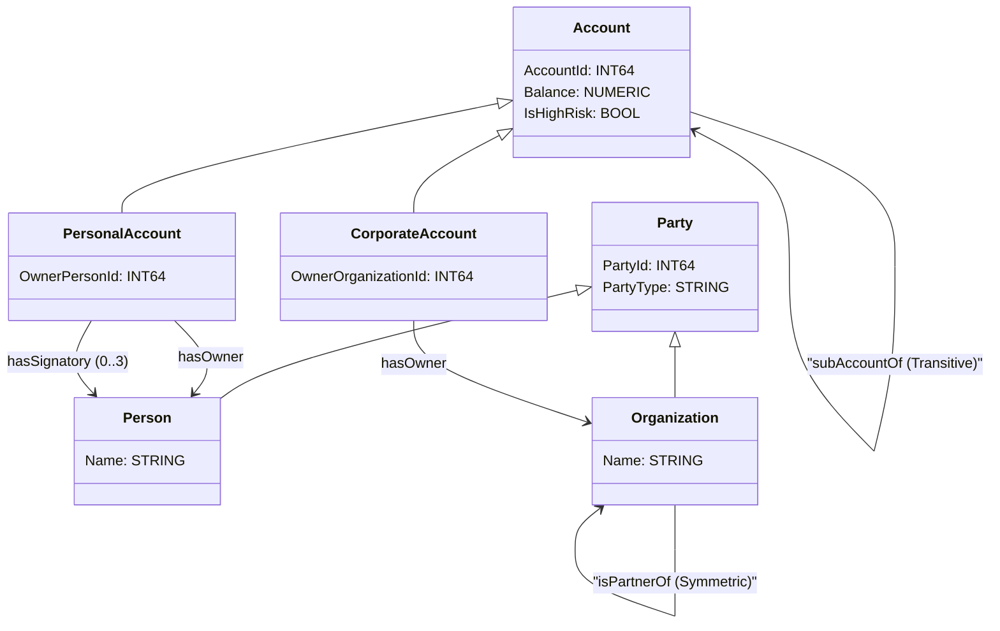

### 2. Pharma Ontology

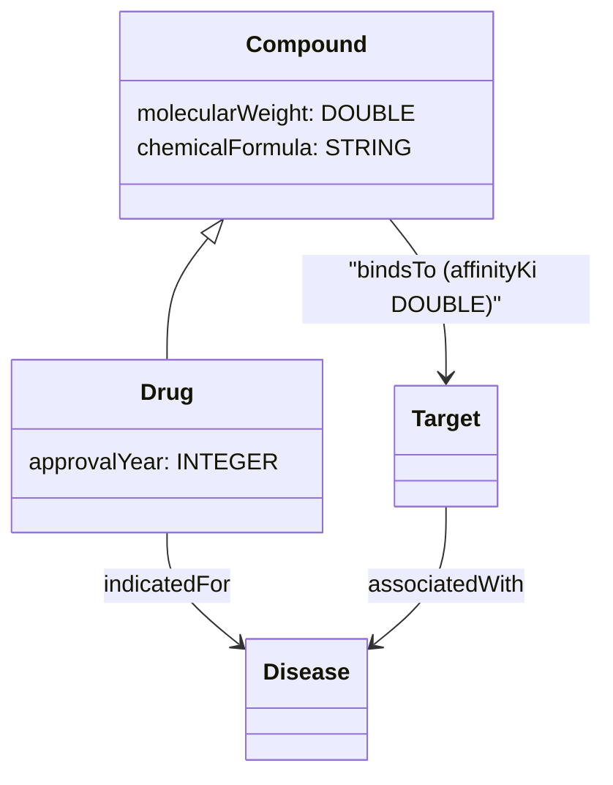

### 3. Entertainment Ontology

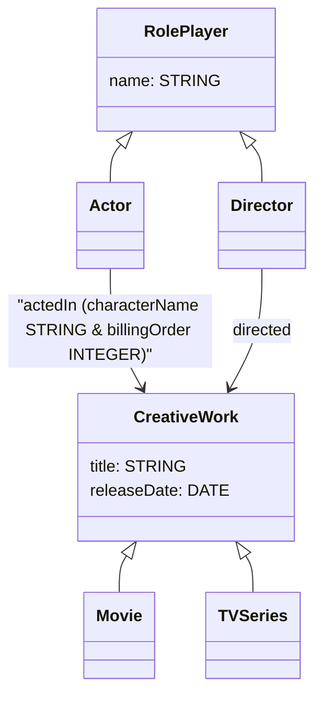

### 4. Knowledgebase Ontology

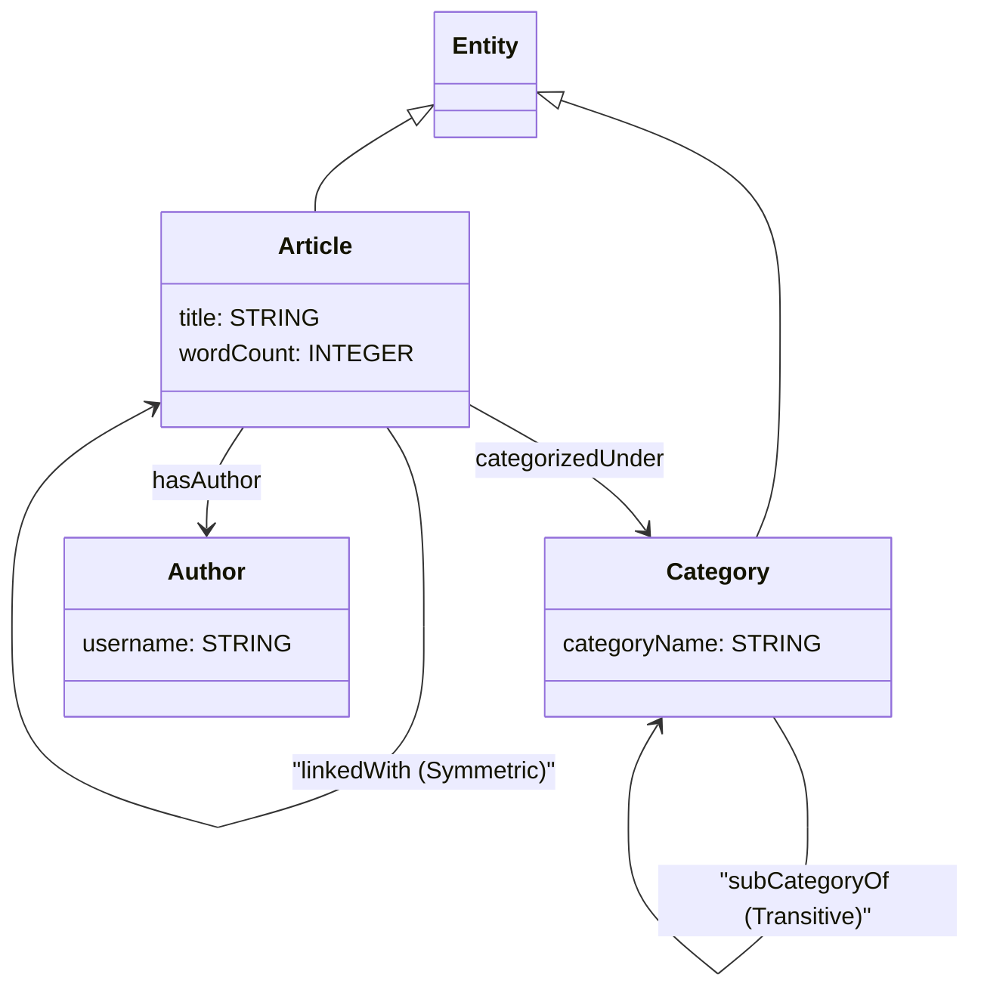

### 5. Social Fraud Ontology

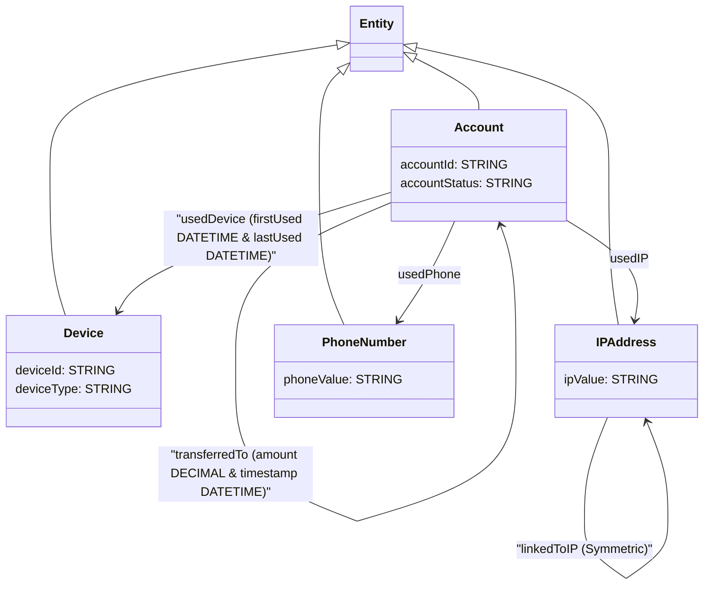

### 6. Supply Chain Ontology

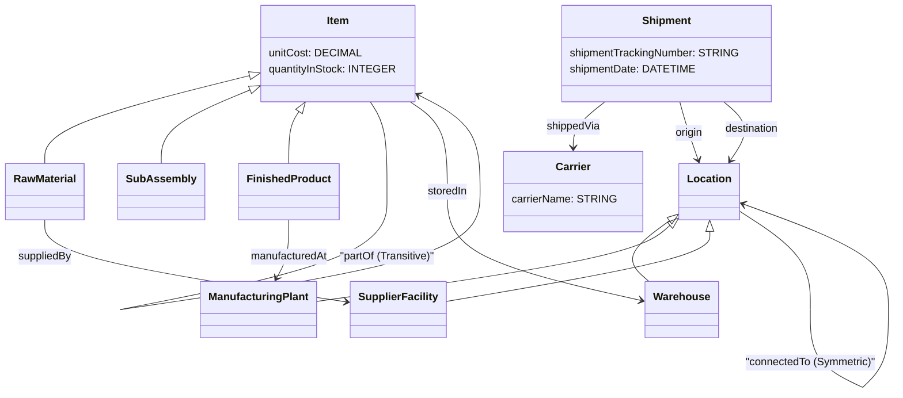

### 7. E-Commerce & Recommendations Ontology

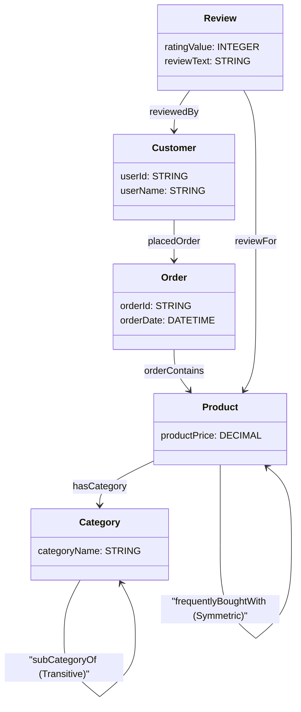

### 8. Cybersecurity Threat Ontology

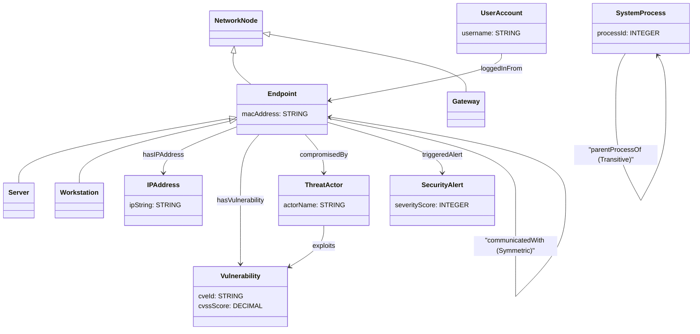

### 9. Healthcare Records Ontology

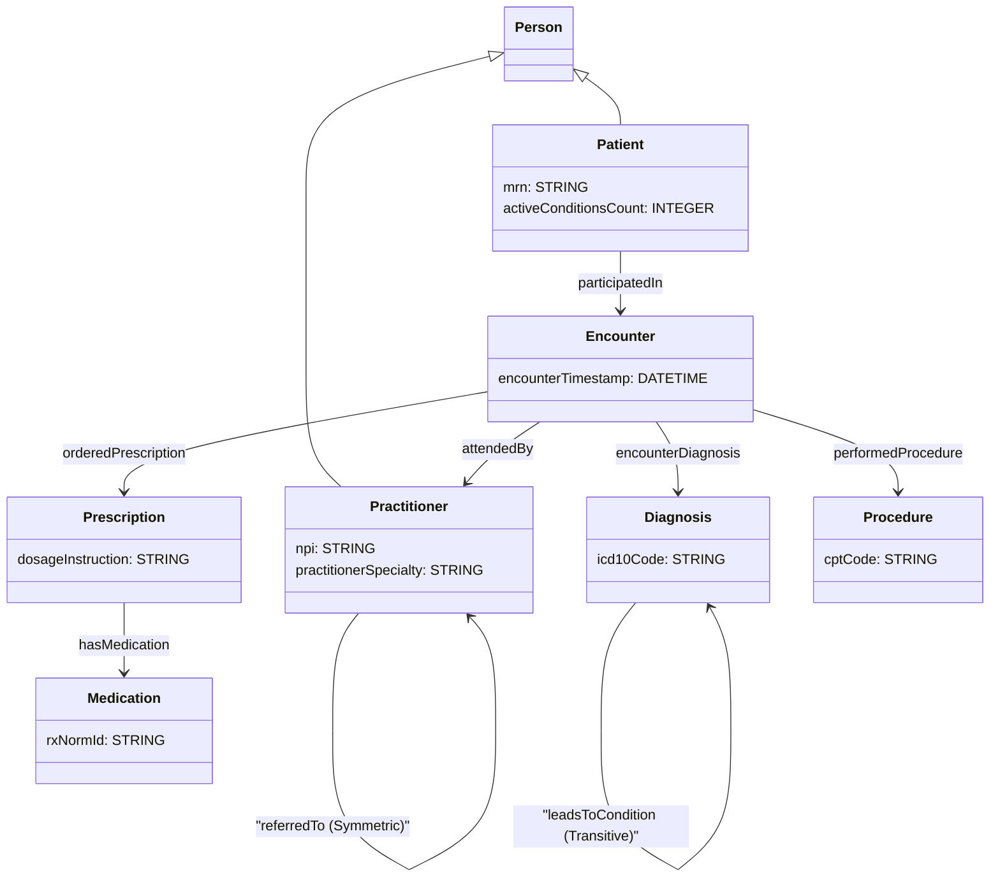

### 10. Smart City IoT Ontology

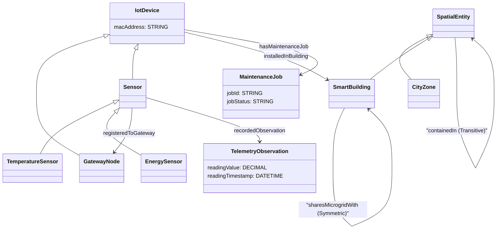

### 11. DCSA Shipping Ontology

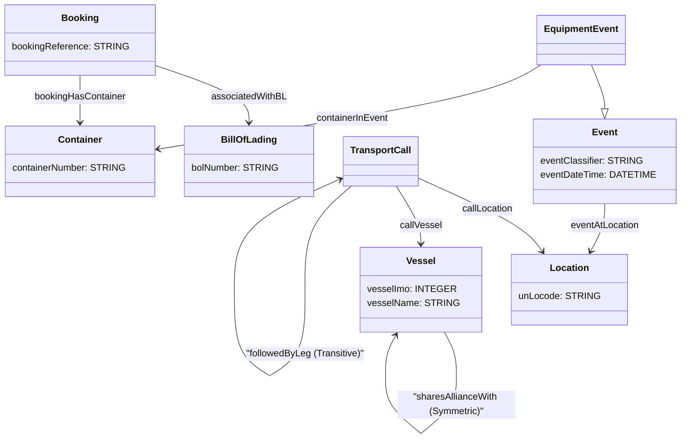

### 12. FIBO Financial Ontology

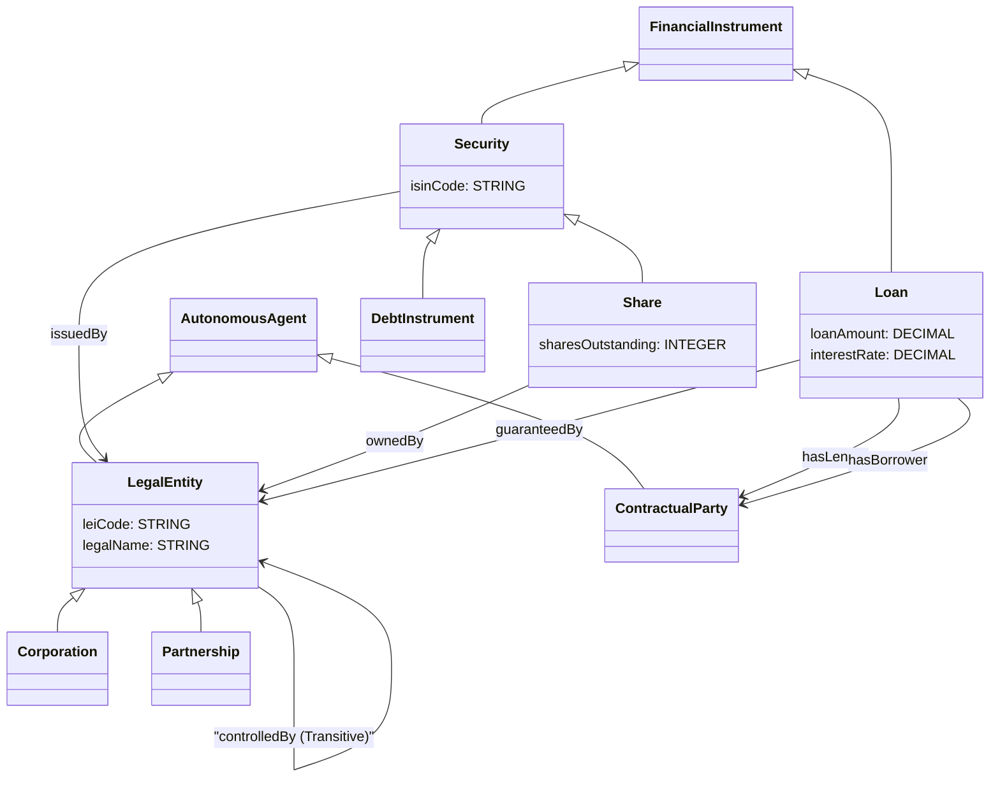

---

## Running Tests with Examples

### 1. Run AI Translation Only
```bash
rdf-spanner-translator translate \
  -i examples/pharma/pharma.ttl \
  -o output/pharma_schema.sql
```

### 2. Run Pipeline with Validation & Self-Correction
```bash
export SPANNER_DATABASE="projects/<PROJECT_ID>/instances/<INSTANCE_ID>/databases/<DATABASE_ID>"

rdf-spanner-translator run \
  -i examples/entertainment/entertainment.ttl \
  -o output/entertainment_schema.sql \
  --mcp-tool "create_database"
```
