# Example Ontologies, SHACL Shapes, and Schemas

This directory contains test ontologies (in Turtle `.ttl` syntax), accompanying SHACL shapes (`shacl.ttl`), and generated/corrected Google Cloud Spanner SQL schemas used to test and verify the RDF-SHACL-to-Spanner Graph DDL translation pipeline.

---

## Files Guide

Click on any domain name to jump directly to its visualization and SHACL rules section.

| Domain / Schema | SHACL Shapes | Description |
| :--- | :--- | :--- |
| **[1. Fintech](#1-fintech)** | [`fintech/shacl.ttl`](fintech/shacl.ttl) | Financial technology domain modeling accounts, parties, and relationships designed to exercise all translation rules. |
| **[2. Pharma](#2-pharma)** | [`pharma/shacl.ttl`](pharma/shacl.ttl) | Drug discovery ontology modeling chemical compounds, protein targets, and diseases, testing drug indications and binding affinities. |
| **[3. Entertainment](#3-entertainment)** | [`entertainment/shacl.ttl`](entertainment/shacl.ttl) | IMDb-like ontology modeling creative works, movies, actors, and directors, designed to test attributes on edge relations. |
| **[4. Knowledgebase](#4-knowledgebase)** | [`knowledgebase/shacl.ttl`](knowledgebase/shacl.ttl) | Wikipedia-style ontology modeling articles, category hierarchies, and linkages, testing transitive category relations and symmetric links. |
| **[5. Social Fraud](#5-social-fraud)** | [`social_fraud/shacl.ttl`](social_fraud/shacl.ttl) | Social network and fraud detection ontology modeling transactions, device sharing, phone, and IP linking. |
| **[6. Supply Chain](#6-supply-chain)** | [`supply_chain/shacl.ttl`](supply_chain/shacl.ttl) | Manufacturing inventory ontology tracking raw materials, sub-assemblies, and finished products, featuring transitive part hierarchies and symmetric routes. |
| **[7. E-Commerce & Recommendations](#7-e-commerce--recommendations)** | [`ecommerce_recommendations/shacl.ttl`](ecommerce_recommendations/shacl.ttl) | E-commerce purchase and behavior ontology modeling customer shopping patterns, symmetric co-purchasing, and transitive hierarchies. |
| **[8. Cybersecurity Threat](#8-cybersecurity-threat)** | [`cybersecurity_threat/shacl.ttl`](cybersecurity_threat/shacl.ttl) | Network threat intelligence ontology tracking servers, vulnerabilities, threat actors, symmetric network communication, and transitive process trees. |
| **[9. Healthcare Records](#9-healthcare-records)** | [`healthcare_records/shacl.ttl`](healthcare_records/shacl.ttl) | Clinical EHR ontology modeling patient encounters, practitioners, procedures, symmetric referral networks, and transitive etiology paths. |
| **[10. Smart City IoT](#10-smart-city-iot)** | [`smart_city_iot/shacl.ttl`](smart_city_iot/shacl.ttl) | Smart building and IoT sensor network ontology featuring transitive spatial containment, symmetric power grids, and telemetry equivalent classes. |
| **[11. DCSA Shipping](#11-dcsa-shipping)** | [`dcsa_shipping/shacl.ttl`](dcsa_shipping/shacl.ttl) | DCSA standard-aligned logistics ontology modeling bookings, transport calls, containers, transitive voyage legs, and symmetric alliance vessel sharing. |
| **[12. FIBO Financial](#12-fibo-financial)** | [`fibo_financial/shacl.ttl`](fibo_financial/shacl.ttl) | FIBO standard-aligned financial ontology modeling legal entities, corporations, loans, shares, debt instruments, and transitive parent corporate control chains. |

---

## Domain Concepts Covered

The ontologies and SHACL shapes test the translation logic against key semantics:

1. **Class Inheritance & Hierarchies:**
   - Account/Subclass mappings (Table-Per-Concrete-Class pattern), with inheritance preserved dynamically via `LABEL` declarations in the logical property graph.
2. **Symmetric Relationships:**
   - The relationship `isPartnerOf` (Organization) and `linkedWith` (Article) are symmetric. The generated SQL uses constraints to store only one direction, while GQL pattern queries traverse it bidirectionally.
3. **Transitive Relationships:**
   - `subCategoryOf` (Wikipedia Category) and `subAccountOf` (Fintech Account) are transitive.
4. **Properties on Edges:**
   - Properties like `affinityKi` on `bindsTo` (Pharma) and `characterName`/`billingOrder` on `actedIn` (Entertainment) map directly to edge properties.
5. **SHACL Property Constraints:**
   - `sh:datatype` maps to physical SQL data types.
   - `sh:minCount 1` translates to `NOT NULL` constraints on columns.
   - `sh:maxCount` translates to single-valued scalar columns or defines cardinality bounds (e.g., maximum signatories on an account).

---

## Domain Walkthroughs & Visualizations

These sections show the logical entities, properties, and relationships (symmetric and transitive) modeled by the ontologies, along with their matching SHACL rules.

### 1. Fintech

* **Files:** [Ontology](fintech/fintech.ttl) | [SHACL Rules](fintech/shacl.ttl)
* **Description:** Models banking structures, personal/corporate accounts, ownership links, and partner networks.

#### Logical Class Diagram
The diagram below represents the classes, datatype attributes, and object relationships. Cardinality notations (e.g., `0..3` on signatories) match constraints defined in the SHACL shapes.

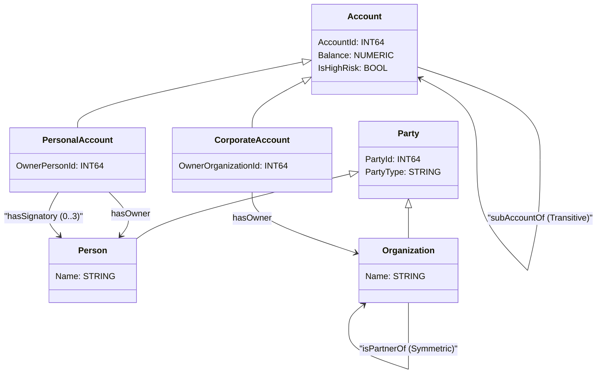

#### Key SHACL Constraints Mapped
* **Node Shapes (`sh:NodeShape`):** `ex:AccountShape`, `ex:PersonalAccountShape`, `ex:CorporateAccountShape`, `ex:PersonShape`, `ex:OrganizationShape`, `ex:PartyShape`.
* **Cardinality constraints:**
  * `ex:PersonalAccountShape` enforces `sh:maxCount 3` on `ex:hasSignatory`.
  * `ex:CorporateAccountShape` enforces `sh:minCount 1` and `sh:maxCount 1` on `ex:hasOwner` (representing `owl:cardinality 1`).

---

### 2. Pharma

* **Files:** [Ontology](pharma/pharma.ttl) | [SHACL Rules](pharma/shacl.ttl)
* **Description:** Models chemical compounds, protein targets, diseases, drug indications, and binding affinities.

#### Logical Class Diagram

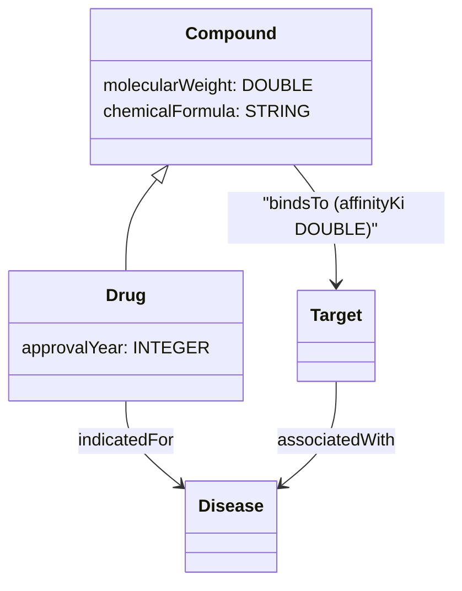

#### Key SHACL Constraints Mapped
* **Node Shapes:** `ex:CompoundShape`, `ex:DrugShape`, `ex:TargetShape`, `ex:DiseaseShape`.
* **Property Datatypes:** `molecularWeight` (`xsd:double`), `chemicalFormula` (`xsd:string`), `approvalYear` (`xsd:integer`).
* **Object Properties:** `Compound.bindsTo` targets `ex:TargetShape` (`sh:class ex:Target`).

---

### 3. Entertainment

* **Files:** [Ontology](entertainment/entertainment.ttl) | [SHACL Rules](entertainment/shacl.ttl)
* **Description:** IMDb-like creative works ontology, modeling movies, TV series, actors, and directors, with properties on edges.

#### Logical Class Diagram

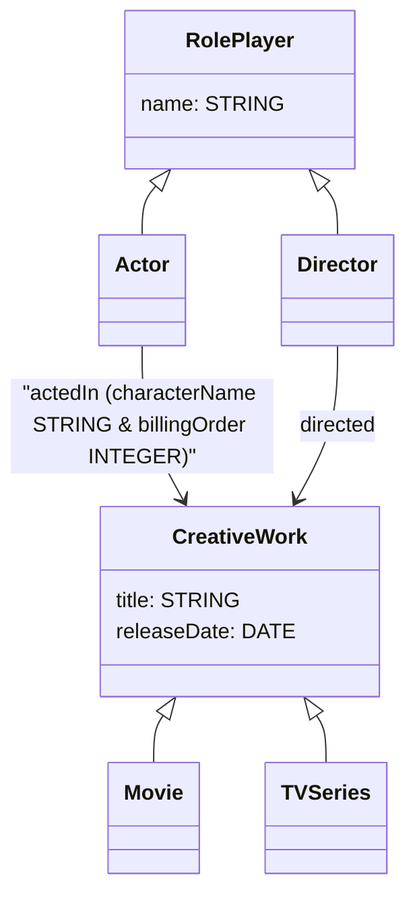

#### Key SHACL Constraints Mapped
* **Node Shapes:** `ex:ActorShape`, `ex:DirectorShape`, `ex:MovieShape`, `ex:TVSeriesShape`, `ex:CreativeWorkShape`, `ex:RolePlayerShape`.
* **Property Datatypes:** `characterName` (`xsd:string`), `billingOrder` (`xsd:integer`), `releaseDate` (`xsd:date`).

---

### 4. Knowledgebase

* **Files:** [Ontology](knowledgebase/knowledgebase.ttl) | [SHACL Rules](knowledgebase/shacl.ttl)
* **Description:** Wikipedia articles, category hierarchies, symmetric linkage networks, and transitive category links.

#### Logical Class Diagram

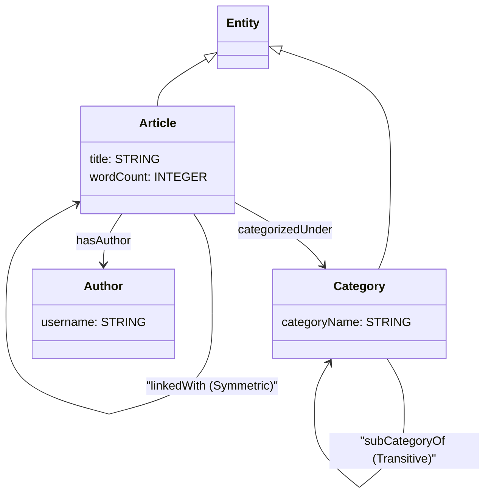

#### Key SHACL Constraints Mapped
* **Node Shapes:** `ex:ArticleShape`, `ex:CategoryShape`, `ex:AuthorShape`, `ex:EntityShape`.
* **Cardinality constraints:**
  * `ex:ArticleShape` enforces `sh:minCount 1` on `ex:hasAuthor` and `ex:categorizedUnder`.

---

### 5. Social Fraud

* **Files:** [Ontology](social_fraud/social_fraud.ttl) | [SHACL Rules](social_fraud/shacl.ttl)
* **Description:** Social network transaction flows, device sharing, phone, and IP subnet sharing.

#### Logical Class Diagram

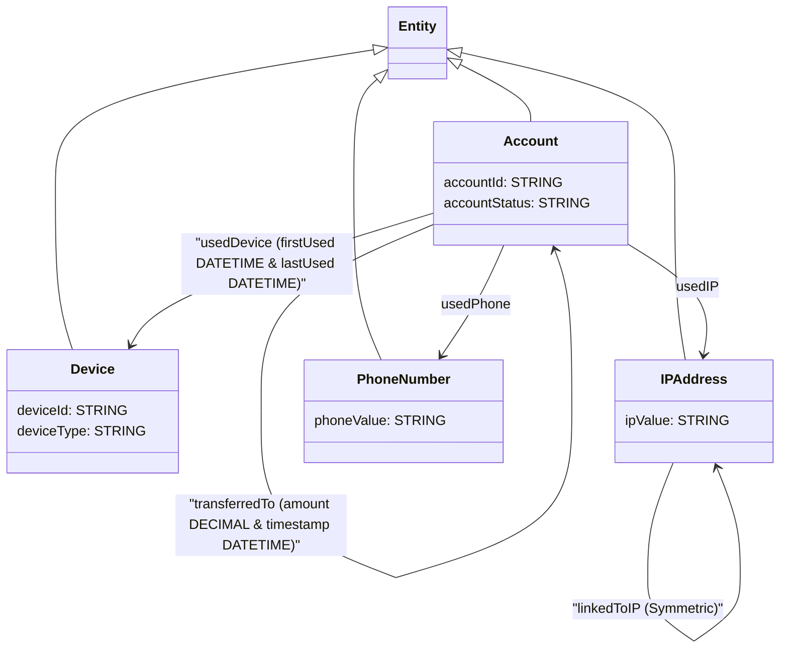

#### Key SHACL Constraints Mapped
* **Node Shapes:** `ex:AccountShape`, `ex:DeviceShape`, `ex:IPAddressShape`, `ex:PhoneNumberShape`, `ex:EntityShape`.
* **Cardinality constraints:**
  * `ex:AccountShape` enforces `sh:minCount 1` on `ex:usedDevice`, `ex:usedIP`, and `ex:usedPhone`.

---

### 6. Supply Chain

* **Files:** [Ontology](supply_chain/supply_chain.ttl) | [SHACL Rules](supply_chain/shacl.ttl)
* **Description:** Bill-of-materials, warehousing, supplier routes, transitive part hierarchies, and symmetric transit routes.

#### Logical Class Diagram

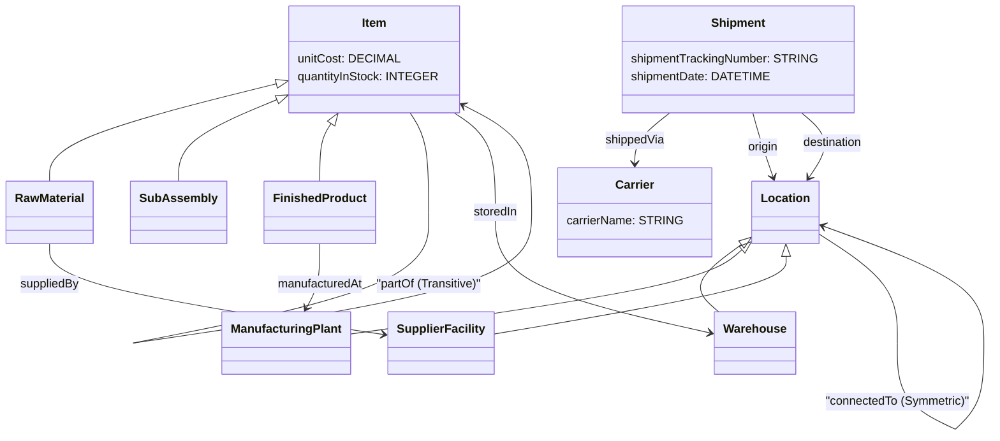

#### Key SHACL Constraints Mapped
* **Node Shapes:** `ex:LocationShape`, `ex:ItemShape`, `ex:ShipmentShape`, `ex:CarrierShape`, `ex:WarehouseShape`, `ex:ManufacturingPlantShape`, `ex:SupplierFacilityShape`, `ex:RawMaterialShape`, `ex:SubAssemblyShape`, `ex:FinishedProductShape`.

---

### 7. E-Commerce & Recommendations

* **Files:** [Ontology](ecommerce_recommendations/ecommerce_recommendations.ttl) | [SHACL Rules](ecommerce_recommendations/shacl.ttl)
* **Description:** Customer purchasing history, reviews, symmetric co-purchasing, and transitive category hierarchies.

#### Logical Class Diagram

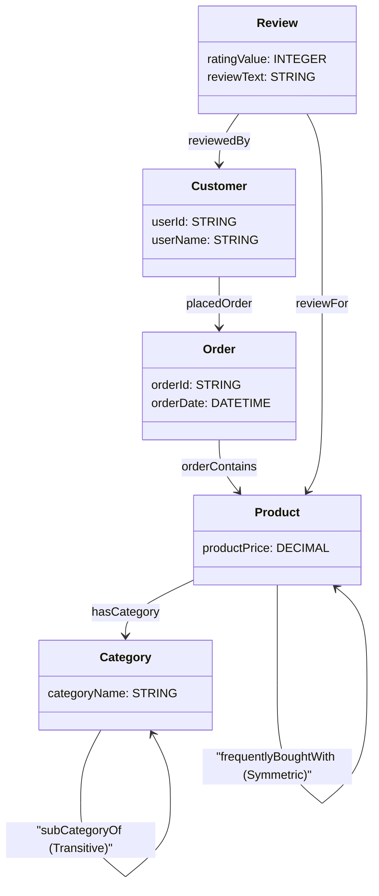

#### Key SHACL Constraints Mapped
* **Node Shapes:** `ex:CustomerShape`, `ex:OrderShape`, `ex:ProductShape`, `ex:ReviewShape`, `ex:CategoryShape`.
* **Property Datatypes:** `productPrice` (`xsd:decimal`), `ratingValue` (`xsd:integer`), `orderDate` (`xsd:dateTime`).

---

### 8. Cybersecurity Threat

* **Files:** [Ontology](cybersecurity_threat/cybersecurity_threat.ttl) | [SHACL Rules](cybersecurity_threat/shacl.ttl)
* **Description:** Vulnerability scanning, servers, workstations, threat actors, symmetric network communication, and transitive process trees.

#### Logical Class Diagram


#### Key SHACL Constraints Mapped
* **Node Shapes:** `ex:NetworkNodeShape`, `ex:EndpointShape`, `ex:ServerShape`, `ex:WorkstationShape`, `ex:IPAddressShape`, `ex:VulnerabilityShape`, `ex:ThreatActorShape`, `ex:SecurityAlertShape`, `ex:UserAccountShape`, `ex:SystemProcessShape`.

---

### 9. Healthcare Records

* **Files:** [Ontology](healthcare_records/healthcare_records.ttl) | [SHACL Rules](healthcare_records/shacl.ttl)
* **Description:** Clinical encounters, EHR records, practitioners, procedures, symmetric referral networks, and transitive etiology paths.

#### Logical Class Diagram

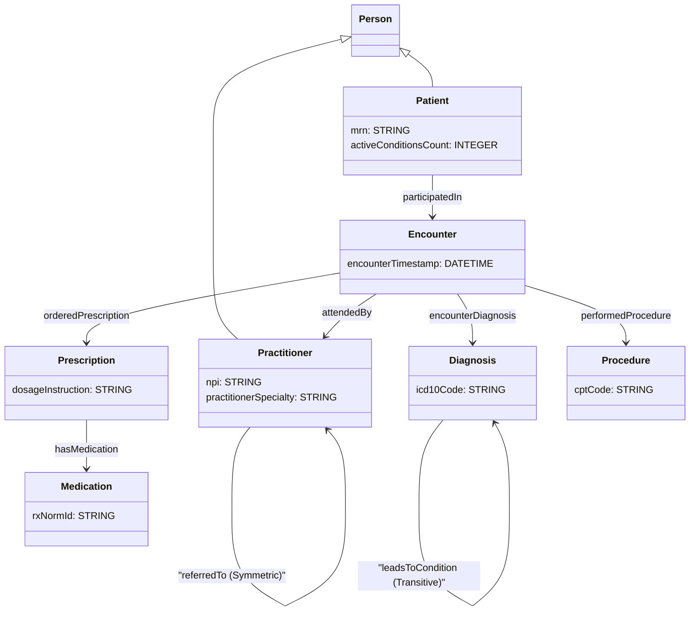

#### Key SHACL Constraints Mapped
* **Node Shapes:** `ex:PersonShape`, `ex:PatientShape`, `ex:PractitionerShape`, `ex:EncounterShape`, `ex:DiagnosisShape`, `ex:MedicationShape`, `ex:PrescriptionShape`, `ex:ProcedureShape`.

---

### 10. Smart City IoT

* **Files:** [Ontology](smart_city_iot/smart_city_iot.ttl) | [SHACL Rules](smart_city_iot/shacl.ttl)
* **Description:** IoT sensor networks, microgrid sharing, city zones, transitive spatial containment, and symmetric power sharing.

#### Logical Class Diagram

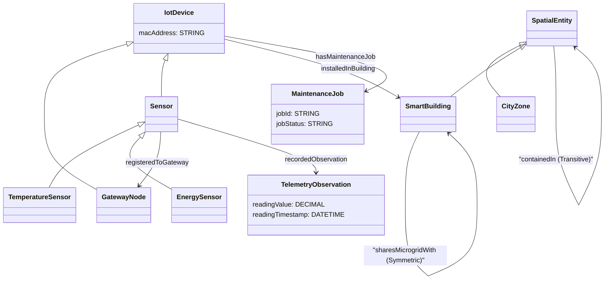

#### Key SHACL Constraints Mapped
* **Node Shapes:** `ex:SpatialEntityShape`, `ex:CityZoneShape`, `ex:SmartBuildingShape`, `ex:IotDeviceShape`, `ex:GatewayNodeShape`, `ex:SensorShape`, `ex:TemperatureSensorShape`, `ex:EnergySensorShape`, `ex:TelemetryObservationShape`, `ex:MaintenanceJobShape`.

---

### 11. DCSA Shipping

* **Files:** [Ontology](dcsa_shipping/dcsa_shipping.ttl) | [SHACL Rules](dcsa_shipping/shacl.ttl)
* **Description:** Booking references, bills of lading, containers, transport calls, transitive transport legs, and symmetric alliances.

#### Logical Class Diagram

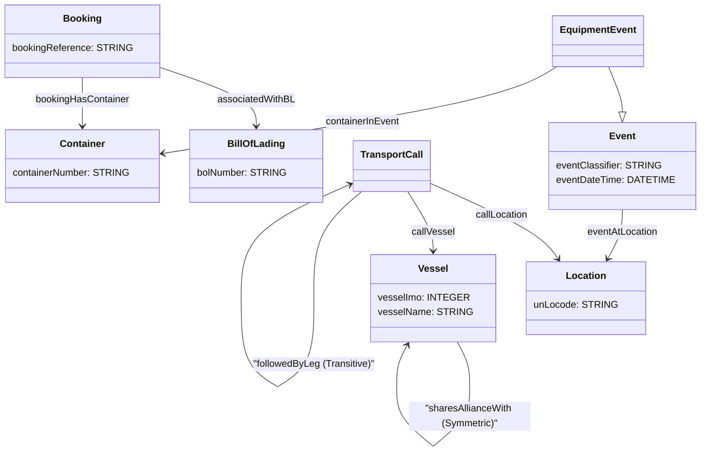

#### Key SHACL Constraints Mapped
* **Node Shapes:** `ex:BookingShape`, `ex:BillOfLadingShape`, `ex:ContainerShape`, `ex:VesselShape`, `ex:LocationShape`, `ex:TransportCallShape`, `ex:EventShape`.
* **Cardinality constraints:**
  * `ex:ContainerShape` enforces `sh:minCount 1` and `sh:maxCount 1` on `ex:containerNumber` (representing `owl:cardinality 1`).

---

### 12. FIBO Financial

* **Files:** [Ontology](fibo_financial/fibo_financial.ttl) | [SHACL Rules](fibo_financial/shacl.ttl)
* **Description:** Legal entities, shares, loans, contract parties, debt instruments, and transitive parent corporate control chains.

#### Logical Class Diagram

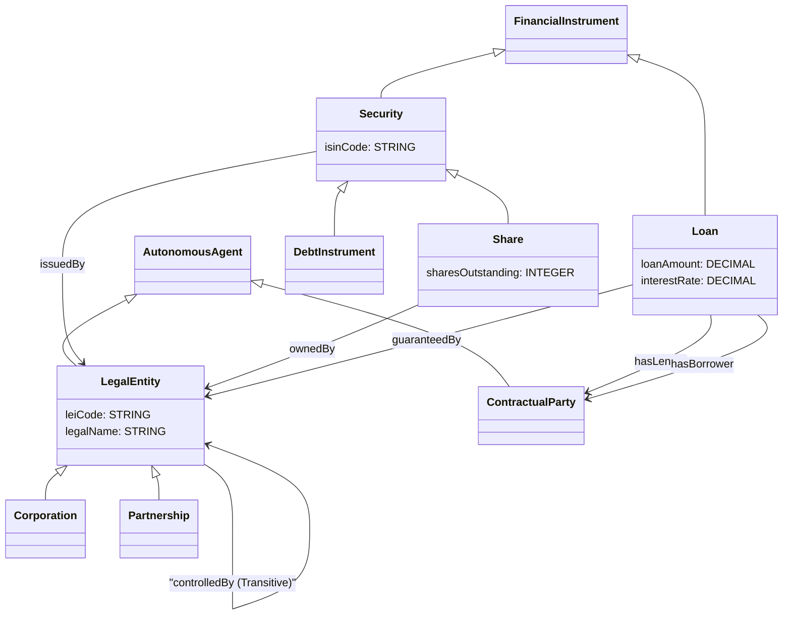

#### Key SHACL Constraints Mapped
* **Node Shapes:** `ex:AutonomousAgentShape`, `ex:LegalEntityShape`, `ex:CorporationShape`, `ex:PartnershipShape`, `ex:ContractualPartyShape`, `ex:FinancialInstrumentShape`, `ex:SecurityShape`, `ex:ShareShape`, `ex:DebtInstrumentShape`, `ex:LoanShape`.

---

## Running Tests with Examples

### 1. Run AI Translation (Guided by SHACL Shapes)
```bash
rdf-spanner-translator translate \
  -i examples/pharma/pharma.ttl \
  -s examples/pharma/shacl.ttl \
  -o output/pharma_schema.sql
```

### 2. Run Pipeline with Validation, SHACL Constraints, & Self-Correction
```bash
export SPANNER_DATABASE="projects/<PROJECT_ID>/instances/<INSTANCE_ID>/databases/<DATABASE_ID>"

rdf-spanner-translator run \
  -i examples/entertainment/entertainment.ttl \
  -s examples/entertainment/shacl.ttl \
  -o output/entertainment_schema.sql \
  --mcp-tool "create_database"
```
